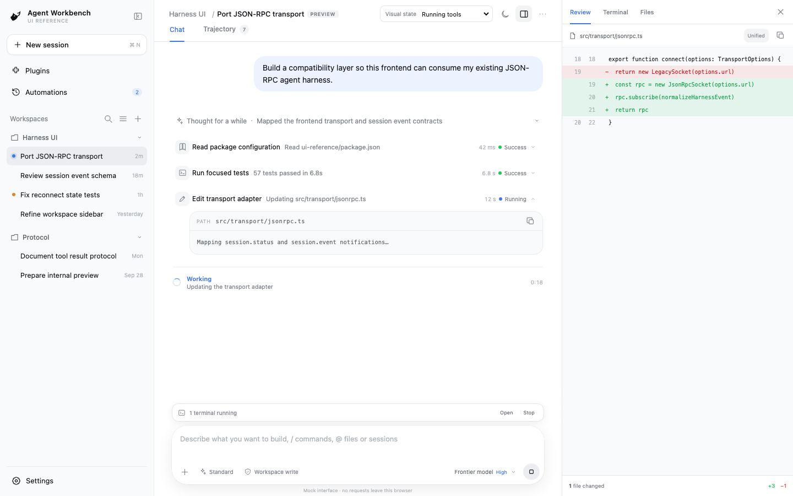

# DeepSeek Harness source and distribution map

This repository vendors the complete DeepSeek Harness `0.2.0-rc.2` source, its complete editable frontend, and built frontend artifacts directly in Git. It also audits the public signed macOS application and provides a starting point for adapting the UI to another JSON-RPC agent harness.

## Start here if you only want the UI

[`ui-reference/`](ui-reference/) is a standalone React/Vite application with no DeepSeek, Cordis, model, account, or backend dependency. It reproduces the desktop shell and important agent states with deterministic mock data, includes a static production build and screenshots, and defines a small adapter boundary for a JSON-RPC harness.

Give your coding agent [`ui-reference/HANDOFF.md`](ui-reference/HANDOFF.md) and the `ui-reference/` directory. The handoff specifies the porting sequence, states, and acceptance criteria.

To clone only the standalone UI instead of the full source/audit archive:

```sh
git clone --depth 1 --filter=blob:none --sparse \
  https://github.com/trevorprater/deepseek-desktop-deobfuscate.git
cd deepseek-desktop-deobfuscate
git sparse-checkout set ui-reference
```



Start with [INTEGRATION.md](INTEGRATION.md) to use Harness from another agent system. The strongest distribution-to-source evidence is in [analysis/SUMMARY.md](analysis/SUMMARY.md); the complete per-file audit is in `analysis/runtime-map.json`.

## Layout

- `upstream-source/` — complete vendored DeepSeek Harness source at release `dsh-v0.2.0-rc.2`; no submodule or blocked upstream fetch is needed.
- `dependencies/libreoffice-kit-source/` — complete vendored Office engine adapter source matching package `0.1.2`.
- `ui-reference/` — backend-free visual reference and copy-ready coding-agent handoff.
- `frontend-build/` — prebuilt Web shell, Electron shell, and all 177 browser plugin bundles/source maps from the official build profile.
- `FRONTEND_PORTING.md` — the concrete UI/transport seam to replace for a different JSON-RPC harness.
- `analysis/` — hashes, package-to-source paths, signature provenance, and file-level comparisons.
- `scripts/` — reproducible capture and audit utilities.

The following local outputs are intentionally gitignored because they are reproducible third-party artifacts, include files above GitHub's per-file limit, or are not required to consume the MIT-licensed Harness source:

- `original/site/` — raw HTML, RSC, JavaScript, and CSS captured from `https://deepseek.com/harness/`.
- `original/distribution/` — the downloaded DMG, updater feed, and notarized application bundle.
- `deobfuscated/site/` — formatted copies of captured text assets.
- `deobfuscated/app-asar/` — the unpacked Electron ASAR and bundled runtime.

Run `scripts/capture-site-assets.mjs` followed by `scripts/format-site-assets.mjs` for the site capture, and `scripts/fetch-and-extract-macos.mjs` for the pinned macOS distribution. Then run `scripts/analyze-distribution.mjs` to regenerate the committed audit.

To install and build both vendored source trees without relying on Git metadata from the blocked upstream repository:

```sh
node scripts/build-vendored-source.mjs
node scripts/verify-vendored-source.mjs
node scripts/verify-frontend-build.mjs
```

The source is MIT licensed; the Office kit is MPL-2.0 and includes its own notices. Preserve the applicable license and third-party notice files when redistributing code or binaries.
